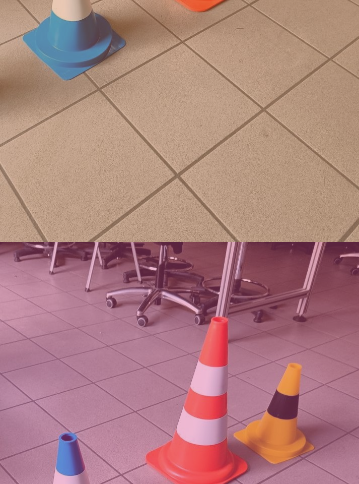

# Project 1

> ⚠️ This document is fairly technical to maintain brevity, if you have **any** questions ask your recruiter or come visit us at floor -2 of Povo 2.

## Abstract

At the start of the processing chain, the camera acquire the frames that will be used to infer information about the environment, one of the first steps is to save each frame in order to use it at a later stage to replay the acquisition.
    
Due to some processing requirements, after the original acquisition, the images are normalized with a simple MINMAX algorithm to a reduced color space, limiting the pixel values between 50 and 200 for each color (keep this in mind).

Due to some unidentified errors, the saved images are corrupted, here is the example that you will be working on:

While the rolling shift is easy to correct, the color shift is more complicated, fortunately during the camera calibration process one of the team member took accurate measurements of the color (color data are provided in the common OpenCV format) of some object in the scene and found the corresponding pixel in the original image:

Y=541 X=128: [250, 158,  3]  
Y=267 X=564: [40, 195, 240]

After recovering the original image you can then proceed with your job, the task is to provide to another component in the chain the boundaries, in pixel coordinates, of the 3 types of cone in the image.
Tto perform this task you have white paper on the type of algorithm to implement.

## To provide
- The code you implemented
- The recovered image
- The 3 bounding boxes (4-tuple with min and max coordinates in x and y direction) in a .txt with 3 lines formatted as "$(cone_color): $(4-tuple)"
- You are furthermore required to be able to explain your implementation choices if asked to.

## Suggestions
Consider more efficient color spaces for extracting the cones from the images

## Notes
PS: while surely it's not discouraged, you are not required to implement each step from scratch, we're not here to re-invent the wheel, choose a commonly available library to perform the various steps and, most importantly, be able to justify your choices if asked to.