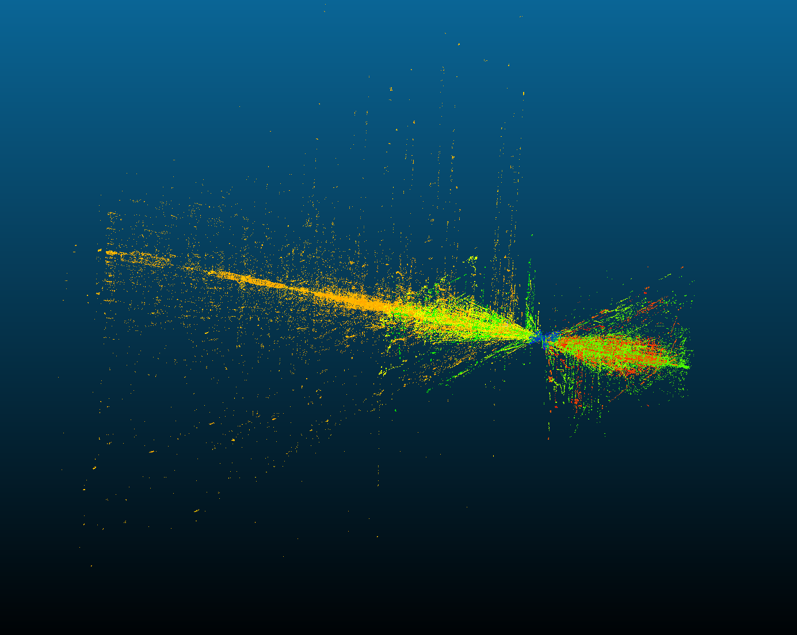

# Project 3

> ⚠️ This document is fairly technical to maintain brevity, if you have **any** questions ask your recruiter or come visit us at floor -2 of Povo 2.

## Abstract

The SLAM algorithm is tasked with producing a point cloud representing the environment in which the car will navigate.

Due to some miscommunication between the people implementing different steps of the code, the SLAM output format is different from the processing chain expected input, in particular, the SLAM algorithm outputs the data in a 3xN matrix, where N is the number of data, the processing chain expects a Nx3 matrix.

Due to some poorly written code, the data is processed without errors applying *automagically* a [reshape function](https://numpy.org/doc/stable/reference/generated/numpy.reshape.html) to the input to obtain a Nx3 matrix with the consequent scrambling of the point coordinates.

Due to this error the resulting point cloud becomes:

Your job is to take the [point cloud file](https://drive.google.com/file/d/1P12oJICJytazgFfZ5TexihfIynk2zewz/view?usp=sharing) and descramble the data, applying the reverse operation to obtain the original, corrected, point cloud and save it in a new .las file with all the information and metadata as the original one.
	
## To provide

- The code you developed
- The point cloud box dimensions and the total number of points
- A screenshot (the file will be moderately heavy and you are not required to re-upload it) of the corrected point cloud
- You are furthermore required to be able to explain your implementation choices if asked to.
	
## Suggestions

- Use LasPy library or equivalent for LAS file manipulation
- Use Numpy library or equivalent for array manipulation
- Open3D or PCL for visualization if you hate yourself, otherwise CloudCompare or DispLAZ is good enough for this task
- No other parameters other than xyz coordinates need to be accounted for
		
## Note

Even if you don't get the corrected point cloud as something intelligible, submit your response nonetheless, it will probably be a mistake in the unscrambling process, the focus of this task is to get confidence with point cloud representation, visualization and manipulations, as for the other tasks you are still required to be able to justify your implementation choices.