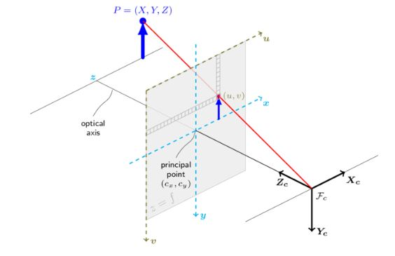

# Project 4

> ⚠️ This document is fairly technical to maintain brevity, if you have **any** questions ask your recruiter or come visit us at floor -2 of Povo 2.

## Abstract

This was one of the questions for the FSG quiz of 2023, the available time was 20 minutes, while the time requirement is pure madness the quiz is doable with some research, if you're able to provide the correct solution (or the correct approach to achieve it) this will be highly regarded in the recruitment process, nonetheless if you want to try it go for it.

## FSG 2023 - Quiz 5

Your vehicle has its right-hand base coordinate frame defined with the x-axis pointing forward into the driving direction and the z-axis upwards.

A camera is positioned on the vehicle as follows, in the vehicle coordinate frame:
- x = 500 mm
- y = 160 mm
- z = 1140 mm

and the Euler angles ZY′X′′
- roll = 100°
- pitch = 0°
- yaw = 90°

Assume the camera has no distortion, a resolution of 1280 px × 1080 px, and the principal point (cx and cy) and the focal lengths (fx and fy) are given by:
- cx = 636 px
- cy = 548 px
- fx = 241 px
- fy = 238 px

The point (u, v)0 is defined to be (u, v)0 = (-cx, -cy) as commonly used.

Within the camera image plane, z-axis in viewing direction, an object center is detected at pixel:
- u = 795 px
- v = 467 px

Another sensor determines the euclidian distance of the object to the camera frame as:
- d = 2.7 m

Calculate the 3D position of the object in the vehicle coordinate frame in meter. Round to three decimals.

## To provide

Give the solution in the following format: x, y, z, e.g. 1.234, 5.678, 9.012 in a simple coordinates.txt file and an explanation of the various steps.
