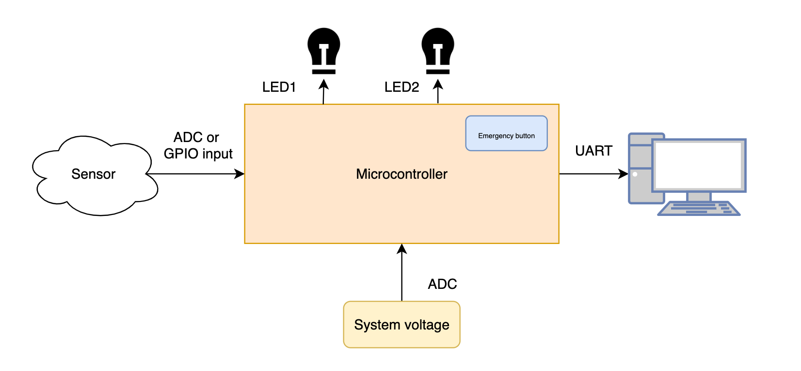

# Recruiting microcontrollers

> ⚠️ This document is fairly technical to maintain brevity, if you have **any** questions ask your recruiter or come visit us at floor -2 of Povo 2.

## Abstract

The main purpose of the project is to see how you approach a typical problem or task that you could face while developing the car, of course, using a a low level perspective.
You are free to choose which embedded device to use between STM, ESP32, Arduino and Texas Instruments boards.

### Task

A new sensor needs to be used in order to add a feature on the car. You are responsible to develop the firmware of an evaluation board which checks periodically the sensor value and do other stuffs such as checking the system voltage and the emergency button. Using **a state machine is required**.
You are free to choose whatever sensor you like (thermistor, encoder, type pressure sensor and so on). Based on the sensor chosen, a different way to manipulate the data will be considered. Please valutate the time you have to develop the project, remember that **a smarter solution will be considered more suitable than a fancier and complex one**. Remember also to stick to the range of values specified in the datasheet (e.g: a specific PTC1000 thermistor can operate between -55°C and 125°C), wether the value read is out of range print it as an error using the UART serial interface.
The systems voltage level is acquired by an ADC input of your microcontroller. The system voltage stands into the following range, 1.8 V to 2.7 V, and it's regulated with a potentiometer. If an _undervoltage_ or an _overvoltage_ is detected the system must run into a `danger state` and turn on one of the two leds, one for each situation, until the danger situation is not detected anymore. Certainly, **both leds on will be considered as an implausible situation**.
The sensor value must be checked every 200 ms, while the system voltage level every 350 ms, the time must be checked with a timer, **busy waiting is not allowed**.
Lastly an emergency button is present and can be pushed if the systems needs to be paused, it **must be handled with an external interrupt** and if it is pressed the board must go into a `waiting state` and then if pressed again it has to return to the `running state`. During the `waiting state` the board has to don't do nothing except for printing the `"Board in waiting state - please press the emergency button"` message every 500 ms, in this case busy waiting is allowed.
_Note that the default button of your chosen board can be used as emergency button._

A brief recap:

- Use a state machine
- Read one sensor (implementing a second sensor will be considered as a plus but it's not mandatory), every 200 ms
- Manipulate the raw data in a correct way
- Check the system voltage every 350 ms (1.8-2.7V is ok, otherwise act as an error occurred)
- Use timers to check the acquisitions timing
- Turn on one led in the case of _overvoltage_, and turn on the other one in the case of _undervoltage_ (wether won't be enough leds available GPIO pins output will be considered acceptable)
- Use serial communication (UART) to display:
  - values acquired (showing the acquisition time)
  - error states
  - leds status
  - waiting state

## Prerequisites

Typically when facing microcontrollers you should have these prerequisites:

- Basic Finite State Machine (FSM) design
- Basic C/C++ knowledge
- Computer architectures
- Basic electronics knowledge

**MicroPython is not considered a prerequisite** (_just kidding_)

Don't be afraid if you feel not so confident with one or two prerequisites, with this project we try to see even your attitude to learning new things and to solve problems, the lack of some requirements will be fullfilled in the first period with the team support!

### Setup

- Create a new GitHub repository and upload the project files via git
- Start working on the task, creating git commits as you make progress
- When it's time to deliver, please send your recruiter a link to your github repository