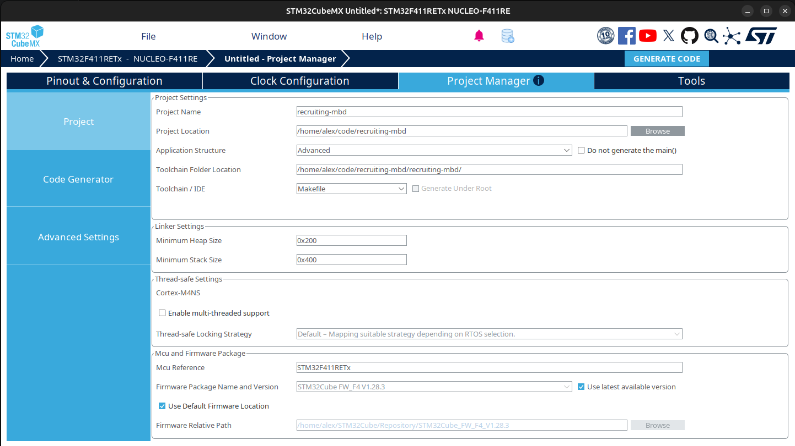
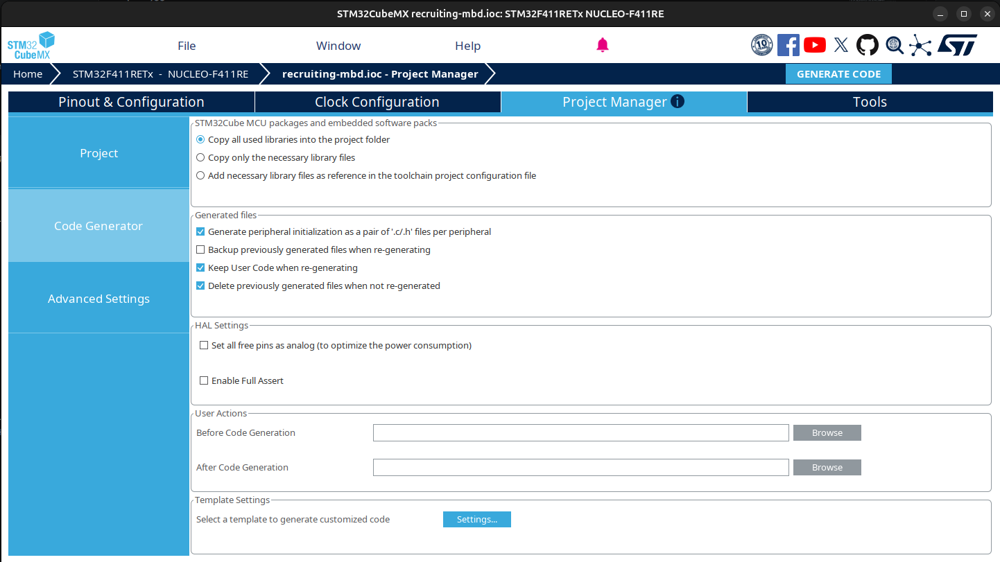
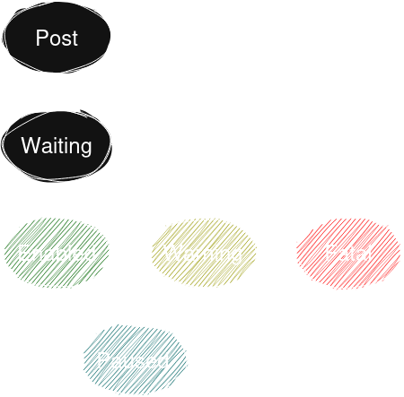
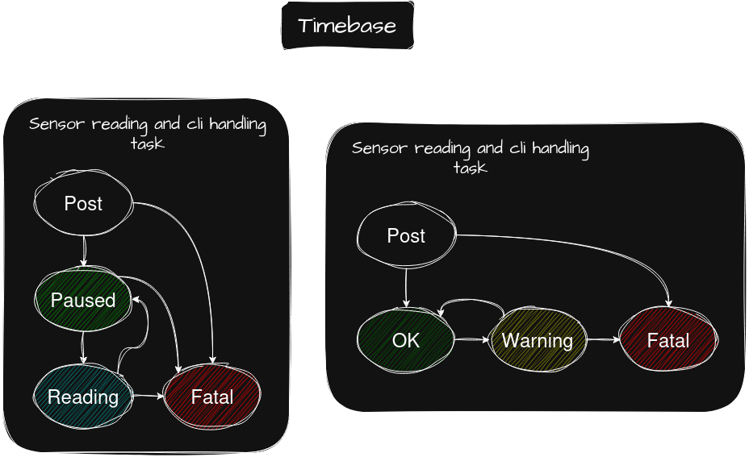

# Microcontroller recruiting task

**Please before starting the task read the entire document carefully more than once and make sure you understand the requirements.**

## What you are given
- 1 Nucleo board (STM32C031C6)
- 1 small board with a potentiometer, a voltage divider containing an NTC thermistor and a led.
- Some jumpers and wires to connect the boards together.

## Setting up the development environment

- Download STM32 CubeMX from the [official link](https://www.st.com/en/development-tools/stm32cubemx.html) and install it.
- Create a new project selecting the nucleo board you have been assigned.
- If you select the nucleo board, CubeMX will automatically select the correct MCU for you. Remember when selecting the board to deselect the BSP drivers as they are not needed for this task. If when you generate the code they appear in ```./Drivers/BSP/``` you have to recreate the project with the BSP drivers deselected.
- Once created the project, go to "Project Manager", fill out the project name, location and select "Makefile" as toolchain. Then go into code generator and assure that ```Generate peripheral initialization code in separate files``` is checked. Then click on "GENERATE CODE".




- Install platformio.

- Run `pio init` to generate the platformio project files, there is a sample configuration file provided in the [`platformio.ini`](./sample_platformio.ini) file, you can modify it if you need to. You can also use the `pio init --ide vscode` command to generate the project files for VsCode.

- Then run `pio update` to install the required packages and finally run `pio run` to build the project. If everything is set up correctly, you should see a message like this:

```
Advanced Memory Usage is available via "PlatformIO Home > Project Inspect"
RAM:   [          ]   0.4% (used 528 bytes from 131072 bytes)
Flash: [          ]   0.9% (used 4572 bytes from 524288 bytes)
Building .pio/build/release/firmware.bin
============================ [SUCCESS] Took 7.34 seconds ============================

Environment    Status    Duration
-------------  --------  ------------
release        SUCCESS   00:00:07.344
============================ 1 succeeded in 00:00:07.344 ============================
```

The project is now ready to be built and flashed to the board. You can use the `pio run -t upload` command to flash the firmware to the board. Check that with the `pio device list` command that the board is connected to your computer.

If the upload from platformio fails, you can use the STM32CubeProgrammer to flash the firmware to the board. You can download it from the [official link](https://www.st.com/en/development-tools/stm32cubeprog.html).

(NOTE: VsCode is not required, you can use any IDE of your choice, just install the PIO cli and use the commands above to build and flash the firmware).

### Wiring

You will need to connect the voltage divider to the power and ground pins of the nucleo board. The potentiometer and the thermistor will be connected to the ADC pins of the nucleo board. The led will be connected to a timer enabled GPIO pin of the nucleo board. The user button and the board led are already connected to GPIO pins of the nucleo board.


## Prerequisites


## The task

The task is divided in steps, each step is a milestone. Each step is given in logical and difficulty order. You will be graded on how many steps you complete and how well you implement them. You MUST commit your code FREQUENTLY to your git repository, as this will be used to evaluate your work. Implementing only the mandatory steps will NOT automatically mean that you will enter the next phase. Each candidate will be ranked based on the quality of their implementation and the number of steps completed. Try to score as many points as you can.

### Task

#### Step 1 (mandatory)

Your task is to read the NTC thermistor and the potentiometer in analog (using the ADC in DMA circular mode) and the digital value of the user button (using an EXTI line), apply some filters and send the data to serial. Then implement a small CLI with three commands (you can change the grammar):
- `raw`: remove all filters
- `moving average`: apply a moving average filter with 150 elements
- `random noise`: add artificial random noise <em>ad libitum</em>

Example output (this is just an example, you can change the grammar and the output format as needed):
```
POT_RAW:2048,POT_C:24.3,NTC_RAW:1780,NTC_C:31.7\r\n
```

There must be 2 modes, a cli mode and a streaming mode. In the streaming mode the board is sending the data to serial every 100 ms. Then after the button is pressed the mode should switch to cli mode, where the user can send commands to the board. Another button press should switch back to streaming mode.

#### Step 2 (mandatory)



You will need to implement a small FSM (Finite State Machine) to control the behavior of the system (using the [libfsm-sw](https://github.com/eagletrt/libfsm-sw) library on the dev branch). The FSM should have the following states:
- <b>POST</b>. Power On Self Test, check if the sensors are working correctly. If not, go to the Fatal state. Else, go to the Waiting state.
- <b>Waiting</b>. The CLI is on, the board led is on flashing with 500ms period and 15% duty cycle, sensor reading is off. If the button is pressed or the command `run` is received, go to the Listening state. While in the waiting state the external LED should have a breathing effect (PWM with period 2 seconds and duty cycle 0-100%). The breathing effect should be implemented using a timer peripheral. 
- <b>Listening</b>. The CLI is off and the board led is blinking with period 200ms duty cycle 80% (use a TIMER peripheral). Read the sensor, send via serial the data the same as in step 1 every 100 ms. If the value of the thermistor is greater than the value of the potentiometer by a predefined threshold for 5 seconds continuously, then go to the warning state. If the button is pressed go to the pause state. The external LED should indicate the difference of (thermistor - potentiometer) through PWM. The duty cycle should be 0% when the difference is 0 and 100% when the difference is greater than a predefined threshold.
- <b>Pause</b>. The CLI is on, the board led is blinking with period 2000 ms and duty cycle of 50% (use a TIMER peripheral), sensor reading is off. If the button is pressed or the command `run` is received, go to the Listening state. The external LED should have the same behavior as in the Waiting state.
- <b>Warning</b>. The CLI is off, the led is off, sensor reading is on. You must spam every 200 ms in serial "WARNING". If the button is pressed for more than 2 seconds, go to the Waiting state. If this state persists for more than 10 seconds, go to the Fatal state.
- <b>Fatal</b>. Any error you encounter will redirect you here (especially if HAL functions return anything different than HAL_OK). CLI is off, sensor reading is off, the led is blinking with period 40 ms and duty cycle 50% (use a TIMER peripheral). You must spam every 100 ms in serial "ERROR" explaining what error occured. The only way to exit this state is to reset the MCU by pressing the reset button or the user button (software reset).

#### Step 3 (mandatory)

Create unit tests for the modules you implemented. You must use the native environment of platformio to run the tests. You can use the [Unity](http://www.throwtheswitch.org/unity) framework for this purpose. (A sample configuration and test is provided in the `test` folder).

#### Step 4 (bonus)

Implement a simple serial interface on the host PC to receive the data from the MCU and plot it in real time. You can use any programming language you want. The data should also control the modulation of a sound signal (this part is intentionally vague, extra points for creative solutions).

#### Step 5 (bonus)



Use the [timebase](https://github.com/eagletrt/libtimebase-sw) library to implement a simple scheduler that will allow you to run multiple tasks in parallel. You can use this to implement two separate FSMs, running their respective routines in two tasks, one for the sensor readings and one for the led control. Other FSM agnostic tasks can be implemented through this scheduler like serial communication. Please handle both leds as you see fit (with the timer peripherals and roughly following the behavior described above).
 
#### Extra points

Every (reasonable) extra feature you implement cleanly and correctly will be evaluated and will give you extra points. Some examples of extra features are:
- Use vref to improve the ADC readings.
- Implement a CLI command to change the threshold for the warning state.
- Implement a CLI command to change the moving average filter size.
- Implement a CLI command to change the breathing effect period.
- Clean logging module with timestamps and log levels.
- Creativity will be rewarded within reason.

#### Extra extra points
- Advanced CLI features like command history, tab completion, error detection and correction, etc.
- Sensor outliers detection and handling.
- Add redundancy with IWDT or other methods to improve the reliability of the system.

## Requirements

All code must follow standard code structure: ```./Core/Tests/``` for unit tests, ```./Core/Inc/``` for hardware specific header files, ```./Core/Inc/recruiting/``` for the hardware agnostic header files, ```./Core/Src/``` for hardware specific source files, ```./Core/Src/recruiting/``` for the hardware agnostic source files. Each module should have its own folder within these directories (a sample structure is shown in the image below). You can create additional folders if you need to, but the structure must be clear and easy to follow.

- Your code MUST follow the coding standards given in the [coding standards document](./standards.md). You will be evaluated on how well you follow the coding standards.
- Create a new GitHub repository, the repository name should be: ```embedded-project``` (do not fork this repo -_-).
- Create git commits as you make progress, THEY MUST BE FREQUENT AND DESCRIPTIVE [following standard naming](https://gist.github.com/qoomon/5dfcdf8eec66a051ecd85625518cfd13). You will be evaluated on your git history as well.
- All functions must be documented with Doxygen style comments. You can use the [Doxygen](https://www.doxygen.nl/) tool to generate documentation from your code.
- You must create a comprehensive README file that explains how to build and run your code, as well as how to use the CLI commands. The README file should also include a description of the FSM states and their transitions.

Example file structure:
```
/
├── Core
│   ├── Inc
│   │   ├── recruiting
│   │   │   ├── module_name
│   │   │   │   ├── module-name.h
│   │   │   │   └── module-name-api.h
│   │   │   └── temperature
│   │   │       ├── temperature.h
│   │   │       └── temperature-api.h
│   │   ├── gpio.h
│   │   ├── main.h
│   │   └── stm...
│   └── Src
│       ├── recruiting
│       │   ├── module_name
│       │   │   └── module-name-api.c
│       │   └── temperature
│       │       └── temperature-api.c
│       ├── gpio.c
│       ├── main.c
│       └── stm...
├── Drivers
├── lib
├── test
│   ├── test_example
│   │   └── test-example.c
│   └── test_temperature
│       └── test-temperature.c
├── platformio.ini
├── project_name.ioc
├── startup_stm32xxxxxx.s
└── STM32xxxxxx_FLASH.ld
```
## Tips
- You have 2 full weeks of time to complete the task. Early submission will not be taken into account for evaluation so do not rush, take your time to implement the task correctly and cleanly. 
- Read this document again carefully and make sure you understand the requirements before starting to implement the task. We do not expect you to know everything about embedded programming, but we do expect you to be able to learn and apply new concepts quickly. Use the internet, forums, and documentation to your advantage.
- Be precise, you can do whatever you want that is not specified but we will be strict on the requirements that ARE specified.
- If you have any questions about the task please contact your recruiter, remember though that we are not technical support, we expect you to be able to solve problems on your own. We will only answer questions that are relevant to the task and that cannot be solved by reading the documentation or searching online.

## AI policy
**No AI generated code is allowed** in any way shape or form. You can use AI tools to help you understand concepts, but you must write the code yourself. Any code that is found to be generated by AI (or that you cannot explain yourself when asked) will be disqualified and you will not be taken into consideration.
