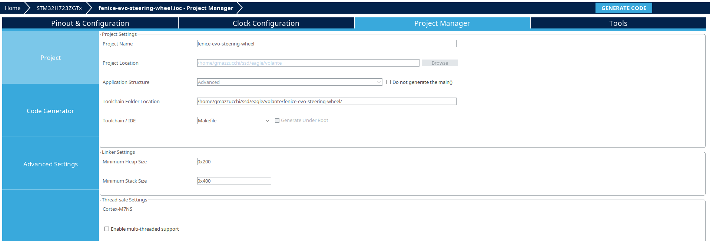
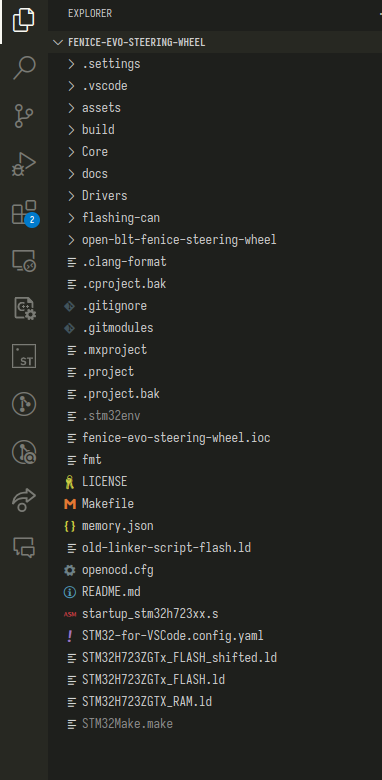
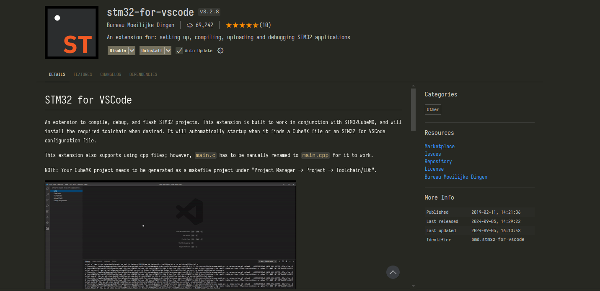

# Microcontroller recruiting task

## Setting up the development environment

- Download STM32 CubeMX from the [official link](https://www.st.com/en/development-tools/stm32cubemx.html) and install it.
- Create a new project selecting the nucleo board you have been assigned.
- Once created the project, go to "Project Manager", fill out the project name, location and select "Makefile" as toolchain. Then click on "GENERATE CODE".

- Open the generated folder in VsCode (you should see something like this).

- Install the STM32 VsCode Extension.

- On the left you should see the extension logo, select it and click on "install build tools", then leave it some time for installation
- After installation you should see on the same place "Build", "Clean build", "Flash", etc...
- Click on build and verify that it builds correctly
- Then connect the nucleo board and verify that it flashes correctly

## The Tools

Aside from the nucleo board, you will be given a Hall Sensor, an easy to use sensor module you can use to sense moving or alternating magnetic fields, typically found in rotating motors, moving magnet, linear magnets, etc. You can build a contactless speed counter or speedometer with this module for measuring the rotation speed of motor by counting the frequency of the motor. You can also use this module to sense a door magnet which is useful if you plan to build projects involves door sensing, window sensing, etc.

> This sensor can works in both analog and digital mode. You can connect the analog output (AO) pin to Arduino to read voltage directly from the A3144 chip, or digital output (DO) to sense the processed output from the module.

Specific Features:
- Comes with A3144 hall-effect sensor chip in front that is sensitive to changing magnetic fields.
- Application such as door sensor, window sensor, contactless tachometer, speedometer, magnetic field sensing, etc.
- Output type : Analog and Digital
- Unipolar hall-effect digital switch

Common Features:
- Logical IC : LM393
- Operating voltage : 5V
- Output current : ?15 mA
- Adjustable sensitivity via potentiometer
- Comes with LED indicators for POWER and OUTPUT
- Fixed bolt holes for easy installation

### Wiring
| Label | Meaning        | Connection                  |
|-------|----------------|-----------------------------|
| VCC   | Power source   | Connect to 5V of system     |
| GND   | Ground         | Connect to GND of system    |
| DO    | Digital Output | Connect to digital IO pin   |
| AO    | Analog Output  | Connect to analog input pin |

## Prerequisites

## The task

The task is divided in steps, each step is a milestone. Each step is given in logical and difficulty order. You will be graded on how many steps you complete and how well you implement them. You MUST commit your code FREQUENTLY to your git repository, as this will be used to evaluate your work. 

### Firmware on the nucleo

#### Step 1

Your task is to read the NTC thermistor and the potentiometer, both in analog (using the ADC in DMA mode) and digital value (using a GPIO input with interrupt), possibly apply some filters and send the data to serial. Then implement a small CLI with three commands:
- `raw`: remove all filters
- `moving average`: apply a moving average filter with 150 elements
- `random noise`: add artificial random noise <em>ad libitum</em>

#### Step 2

You will need to implement a small FSM (Finite State Machine) to control the behavior of the system. The FSM should have the following states:
- <b>POST</b>. Power On Self Test, check if the sensors are working correctly. If not, go to the Error state. Else, go to the Waiting state.
- <b>Waiting</b>. The CLI is on, the board led is on and the external LED is off, sensor reading is off. If the button is pressed or the command `run` is received, go to the Listening state.
- <b>Listening</b>. The CLI is off and the led is blinking period 200ms duty cycle 50% (use a TIMER peripheral). Read the sensor, send via serial the data the same as in step 1. If the difference between the thermistor and potentiometer is greater than a predefined threshold for 5 seconds continuously, then go to the warning state otherwise if the button is pressed or the command `pause` is received, go to the pause state.
- <b>Pause</b>. The CLI is on, the led is blinking with period 2000 ms and duty cycle of 50% (use a TIMER peripheral), sensor reading is off. If the button is pressed or the command `run` is received, go to the Listening state.
- <b>Warning</b>. The CLI is off, the led is off, sensor reading is off. You must spam every 200 ms in serial "WARNING". If the button is pressed for more than 2 seconds, go to the Waiting state. If this state persists for more than 10 seconds, go to the Error state.
- <b>Error</b>. Any error you encounter will redirect you here (especially if HAL functions return anything different than HAL_OK). CLI is off, sensor reading is off, the led is blinking with period 40 ms and duty cycle 50% (use a TIMER peripheral). You must spam every 40 ms in serial "ERROR" explaining what error occured. The only way to exit this state is to reset the MCU by pressing the reset button.

#### Step 3

Create unit tests for the modules you implemented. You must use the native environment of platformio to run the tests. You can use the [Unity](http://www.throwtheswitch.org/unity) framework for this purpose. (A sample configuration and test is provided in the `test` folder).

#### Step 4

- While in the waiting state the external LED should have a breathing effect (PWM with period 2 seconds and duty cycle 0-100%). The breathing effect should be implemented using a timer peripheral. The breathing effect should be disabled when the system is in any other state.
- 

#### Step 4

Implement a simple serial interface on the host PC to receive the data from the MCU and plot it in real time. You can use any programming language you want. The data should also control the modulation of a sound signal (this part is intentionally vague, extra points for creative solutions).

#### Step 5

Use the timebase library to implement a simple scheduler that will allow you to run multiple tasks in parallel. You can use this to implement two separate FSMs, one for the sensor readings and one for the led control. Other FSM agnostic tasks can be implemented through this scheduler like serial communication and timer management.

## Requirements

All code must follow standard code structure: ./Core/Tests/ for unit tests, ./Core/Inc/ for hardware specific header files, ./Core/Inc/rec/ for the hardware agnostic header files, ./Core/Src/ for hardware specific source files, ./Core/Inc/rec/ for the hardware agnostic source files. Each module should have its own folder within these directories. You can create additional folders if you need to, but the structure must be clear and easy to follow.

- Create a new GitHub repository and upload the project files via git, start working on the task, creating git commits as you make progress
- When it's time to deliver, please send your recruiter a link to your github repository
- **IT IS MANDATORY A CODE THAT FOLLOWS GOOD PRACTISES**
- **THE SPECIFICATIONS MUST BE FOLLOWED PRECISELY, NO BUGS ARE ALLOWED**

